# Fundamental Algorithms

This repository contains various fundamental algorithms implemented in C and C++, focusing on performance analysis. Each algorithm is accompanied by a brief description and example usage.

## Topics Covered

### Basic File I/O

Handles basic file input/output operations.

### Basic Sort Comparison

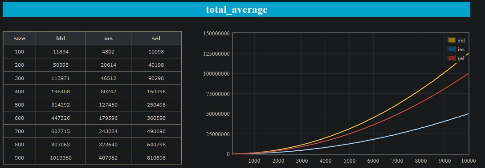
*Average Case of Basic Sort*

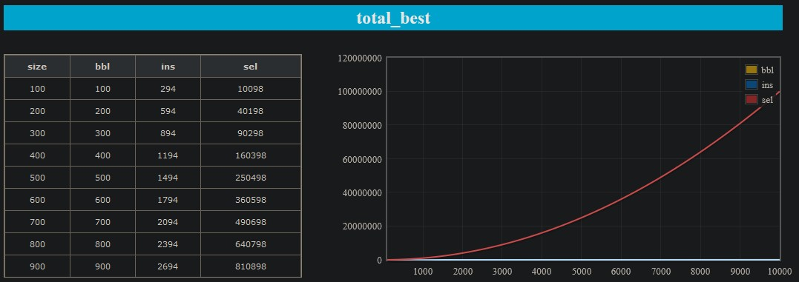
*Best Case of Basic Sort*

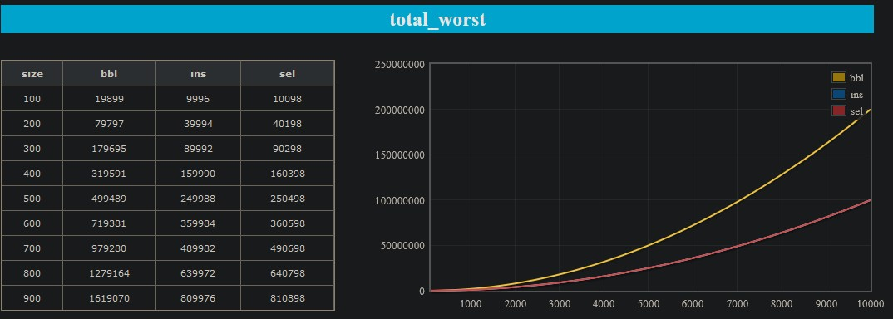
*Worst Case of Basic Sort*

Compares basic sorting algorithms.

### Breadth-First Search (BFS)

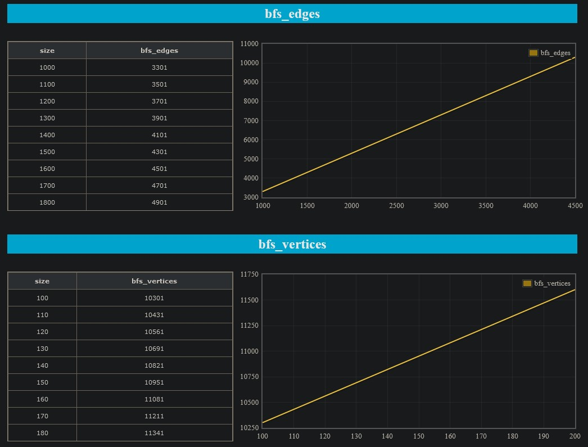
*Performance Analysis of BFS*

Implements the Breadth-First Search algorithm.

### Depth-First Search (DFS)

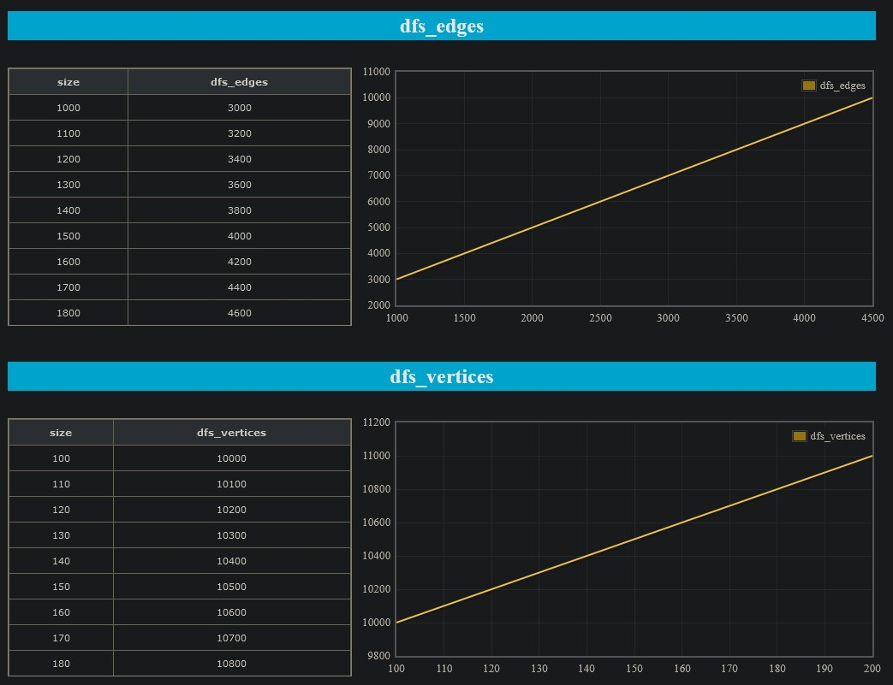
*Performance Analysis of DFS*

Implements the Depth-First Search algorithm.

### Fstream I/O

Demonstrates file input/output operations using `fstream`.

### Hash Tables

*Hash Tables in Action*

Implements hash tables for efficient data retrieval.

### Heaps and Heapsort

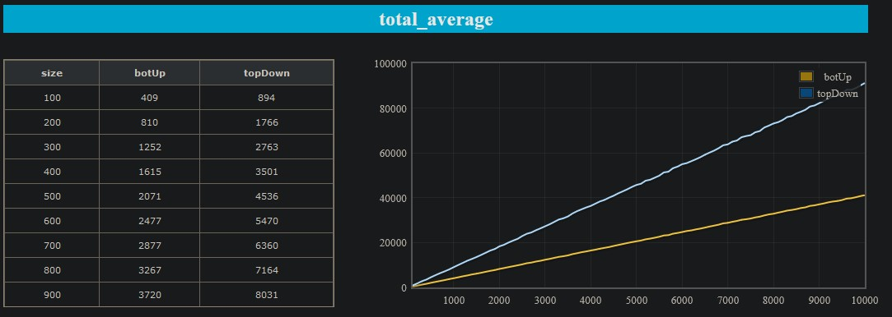
*Average Case of Heapsort*

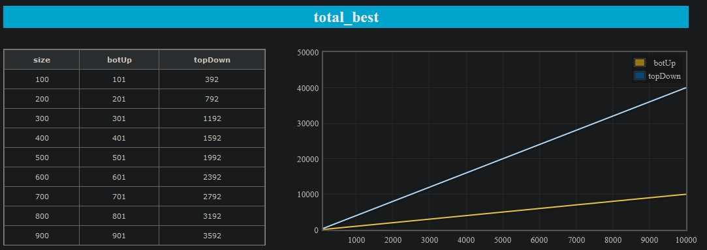
*Best Case of Heapsort*

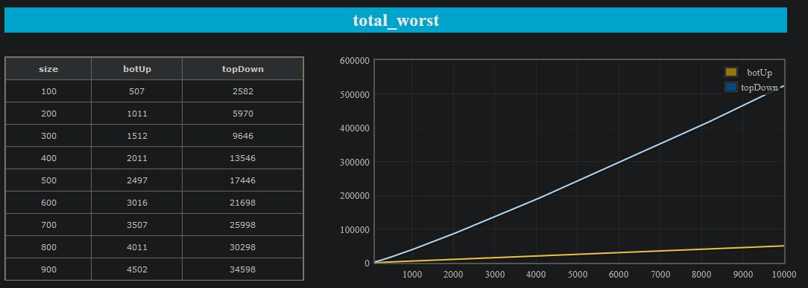
*Worst Case of Heapsort*

Implements heaps and the Heapsort algorithm.

### Kruskal's Minimum Spanning Tree (MST)

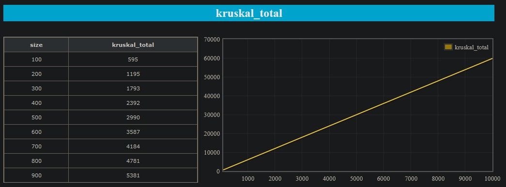
*Performance Report of Kruskal's MST*

Finds the Minimum Spanning Tree using Kruskal's algorithm.

### Merge k Sorted Lists

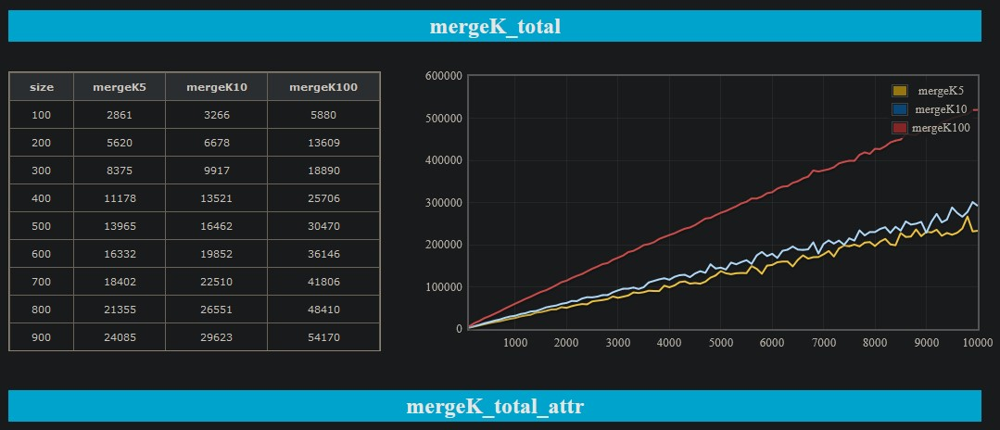
*Merging k Sorted Lists*

Merges k sorted lists efficiently.

### Merge Sort

Implements the Merge Sort algorithm.

### Merge Sort Test

Tests the Merge Sort implementation.

### Profiler Test

Tests the performance of various algorithms.

### Quicksort

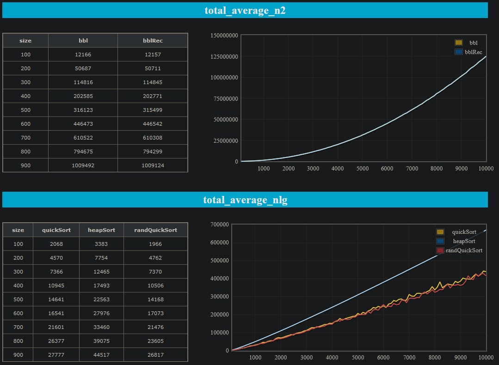
*Average Case of Quicksort*

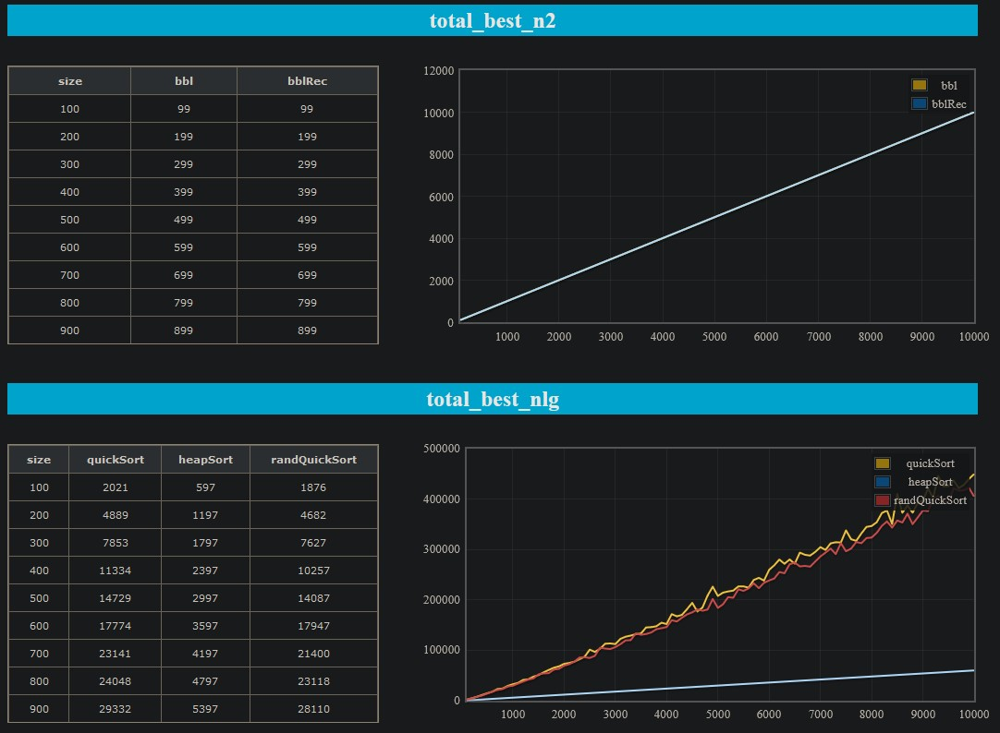
*Best Case of Quicksort*

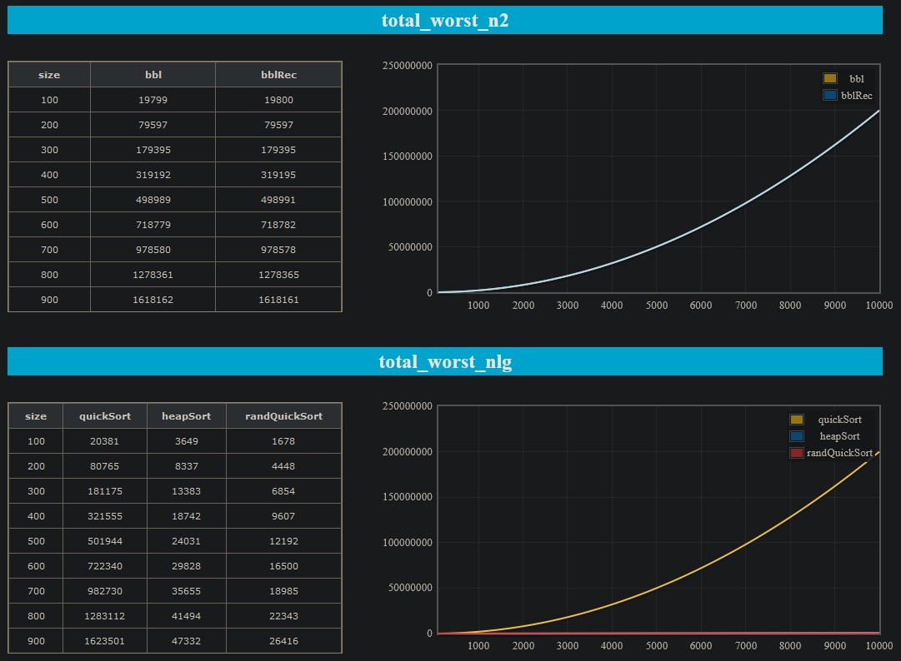
*Worst Case of Quicksort*

Implements the Quicksort algorithm.

### Red-Black Trees

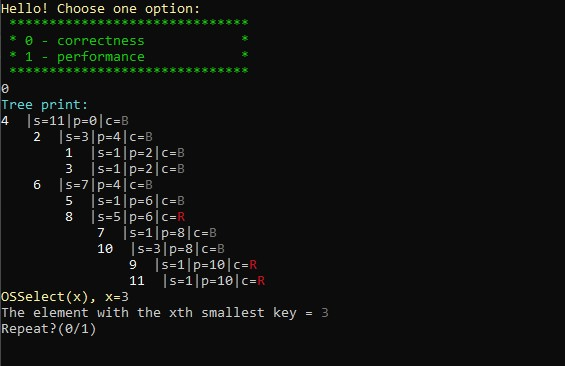
*Red-Black Trees*

Implements Red-Black Trees for balanced binary search trees.

### Tetris

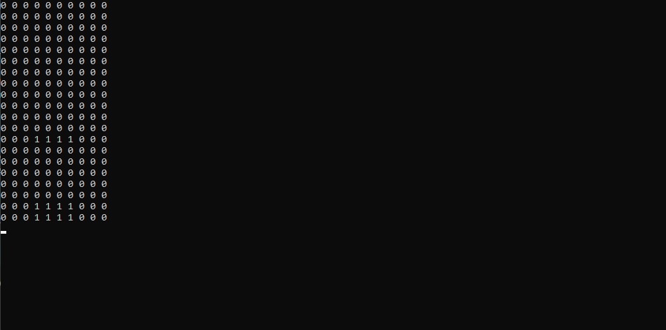
*Console Tetris Game*

A Tetris game implementation.

### Tree Data Structures

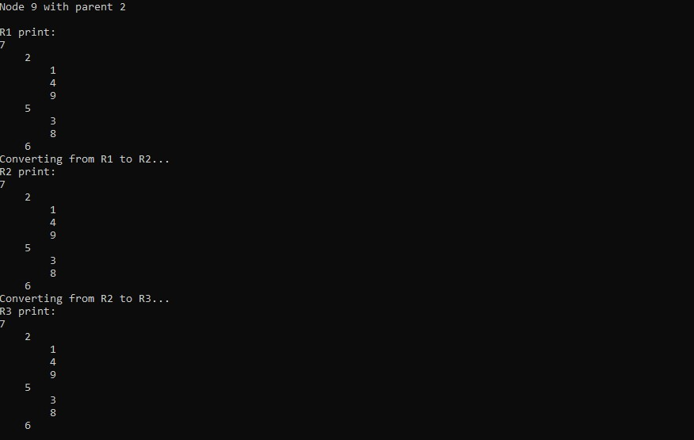
*Various Tree Data Structures*

Implements various tree data structures.

### Tree Traversals and Hybrid Quick Sort

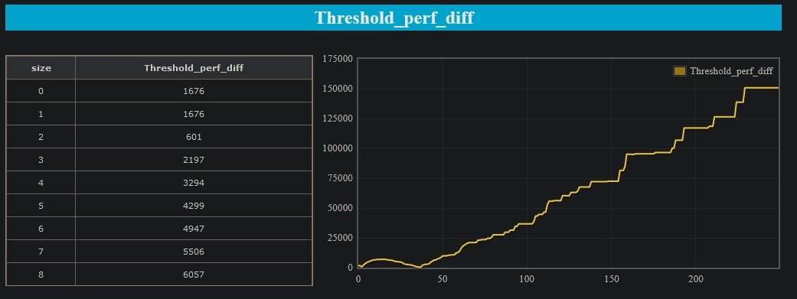
*Threshold Report for Hybrid Quick Sort*

Performs tree traversals and implements a hybrid Quick Sort algorithm.
